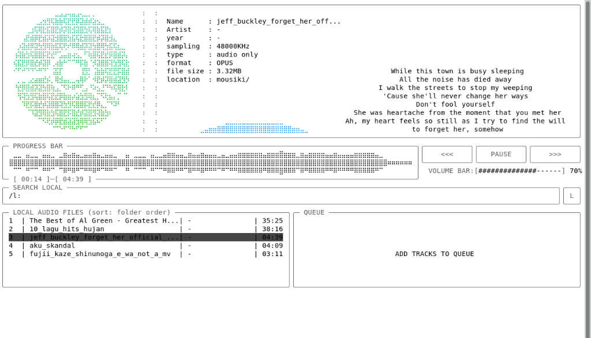

<div align="center">

```
        ██╗██╗     ██████╗ ███╗   ███╗██╗   ██╗███████╗██╗██╗  ██╗ █████╗ 
        ██║██║     ██╔══██╗████╗ ████║██║   ██║╚══███╔╝██║██║ ██╔╝██╔══██╗
        ██║██║     ██████╔╝██╔████╔██║██║   ██║  ███╔╝ ██║█████╔╝ ███████║
        ██║██║     ██╔══██╗██║╚██╔╝██║██║   ██║ ███╔╝  ██║██╔═██╗ ██╔══██║
        ██║███████╗██║  ██║██║ ╚═╝ ██║╚██████╔╝███████║██║██║  ██╗██║  ██║
        ╚═╝╚══════╝╚═╝  ╚═╝╚═╝     ╚═╝ ╚═════╝ ╚══════╝╚═╝╚═╝  ╚═╝╚═╝  ╚═╝
```

# ilrmuzika

**A strictly-typed, low-latency terminal music player & streaming engine.**  
*Written in C++17 · Powered by miniaudio, kissfft, and key-free public APIs.*

[](LICENSE)
[](#)
[](#)
[](#)

</div>

---

<p align="center">
  
</p>

---

## ⚡ Architecture & Features

`ilrmuzika` is a POSIX/Win32-native TUI music streaming client and player designed for immediate responsiveness, low memory overhead, and deterministic execution.

* **Key-Free / No-OAuth Streaming**: Direct integration with open REST endpoints:
  * **Audius API**: Decentralized streaming network & trending charts without user authentication or API keys.
  * **YouTube Innertube**: Sub-second search indexing (<300ms) bypassing heavyweight scraping overhead.
  * **LRCLIB & BetterLyrics**: Real-time synchronized, word-by-word karaoke lyrics with local sidecar `.lrc` caching.
  * **MusicBrainz**: Structured release and artist metadata enrichment.
* **Real-time Audio DSP Pipeline**:
  * Inline 5-Band Biquad Filter (`LowShelf`, `PeakingEQ`, `HighShelf`) running inside miniaudio's real-time audio thread.
  * Hyperbolic tangent (`tanh`) soft-clipping limiter preventing digital clipping during high-gain boost stages.
  * Zero-allocation audio callback ensuring lock-free playback guarantees.
* **Dynamic Visualization Engine**:
  * Radix-2 KissFFT real-input frequency analyzer with multiple visualizer styles (`bars`, `mirrored`, `oscilloscope`, `sparks`).
* **5 Built-in Custom Color Themes**:
  * `aurora-aidil` (Signature emerald green & cyan glow)
  * `tokyo-night` (Deep indigo with cyan accents)
  * `catppuccin` (Mocha pastel palette)
  * `cyberpunk` (High-contrast yellow and magenta)
  * `dracula` (Gothic purple and pink)

---

## 📦 Dependencies & Prerequisites

| Component | Minimum Version | Linux Package | Termux Package | Windows (winget) |
| :--- | :--- | :--- | :--- | :--- |
| **C++ Compiler** | C++17 (GCC 9+, Clang 10+, MSVC 2019+) | `build-essential` / `gcc-c++` | `clang` | Visual Studio C++ Tools |
| **CMake** | `>= 3.16` | `cmake` | `cmake` | `Kitware.CMake` |
| **Make / Ninja** | Standard | `make` | `make` | Visual Studio Build Tools |
| **FFmpeg** | Any modern build | `ffmpeg` | `ffmpeg` | `Gyan.FFmpeg` |
| **yt-dlp** | Latest stable | `yt-dlp` | `python -m pip install yt-dlp` | `yt-dlp.yt-dlp` |
| **Python** | `>= 3.8` | `python3`, `python3-pip` | `python` | `Python.Python.3.11` |
| **Python Requests** | `>= 2.25` (for lyrics) | `pip install requests` | `pip install requests` | `pip install requests` |

---

## 🚀 Installation

### 1. Automated Setup (Recommended)

Run the unified setup script. It automatically detects your operating system, resolves missing dependencies via your system package manager, compiles the binary with `-O3` optimizations, and symlinks it to your `PATH`:

```bash
git clone https://github.com/aidil/ilrmuzika.git
cd ilrmuzika
bash setup.sh
```

---

### 2. Manual Installation by Platform

#### 🐧 Debian / Ubuntu / Linux Mint / Pop!_OS
```bash
# 1. Install prerequisites
sudo apt update
sudo apt install -y cmake build-essential ffmpeg python3 python3-pip yt-dlp

# 2. Install optional lyrics resolver
pip3 install --user requests

# 3. Compile with CMake
cmake -B build -DCMAKE_BUILD_TYPE=Release
cmake --build build -j$(nproc)

# 4. Install binary to user PATH
mkdir -p ~/.local/bin
cp build/ilrmuzika ~/.local/bin/
```

#### 🏔️ Arch Linux / Manjaro
```bash
sudo pacman -Syu --needed cmake base-devel ffmpeg yt-dlp python python-pip
pip install --user requests
cmake -B build -DCMAKE_BUILD_TYPE=Release
cmake --build build -j$(nproc)
sudo cp build/ilrmuzika /usr/local/bin/
```

#### 🎩 Fedora / RHEL
```bash
sudo dnf install -y cmake gcc-c++ make ffmpeg yt-dlp python3 python3-pip
pip3 install --user requests
cmake -B build -DCMAKE_BUILD_TYPE=Release
cmake --build build -j$(nproc)
sudo cp build/ilrmuzika /usr/local/bin/
```

#### 📱 Android (Termux)
```bash
# 1. Update Termux repositories & install packages
pkg update && pkg install -y clang make cmake ffmpeg python git
pip install requests yt-dlp

# 2. Clone and build
git clone https://github.com/aidil/ilrmuzika.git
cd ilrmuzika
cmake -B build -DCMAKE_BUILD_TYPE=Release
cmake --build build -j$(nproc)

# 3. Symlink to Termux bin
cp build/ilrmuzika $PREFIX/bin/
```

#### 🪟 Windows 10 / 11

##### Option A: Native PowerShell (winget)
Run PowerShell as Administrator:
```powershell
git clone https://github.com/aidil/ilrmuzika.git
cd ilrmuzika
.\install.ps1
```

##### Option B: MSYS2 / UCRT64
```bash
pacman -Syu
pacman -S mingw-w64-ucrt-x86_64-gcc mingw-w64-ucrt-x86_64-cmake mingw-w64-ucrt-x86_64-ninja ffmpeg yt-dlp python-requests
cmake -B build -G Ninja -DCMAKE_BUILD_TYPE=Release
ninja -C build
```

##### Option C: Windows Subsystem for Linux (WSL2)
Follow the [Debian / Ubuntu](#-debian--ubuntu--linux-mint--pop_os) instructions inside your WSL terminal. Audio output routes cleanly via PulseAudio / WSLg.

---

## 🎮 Keybindings & Controls

All keybindings are configurable in `~/.config/ilrmuzika/config.txt`.

### 🔍 Discovery & Playback
| Key | Function |
| :--- | :--- |
| `/` | Open local library search filter |
| `/s: <query>` | Online stream search (YouTube Innertube / Audius) |
| `p` / `ENTER` | Toggle Play / Pause |
| `n` / `b` | Next / Previous track |
| `ARROW_LEFT` / `ARROW_RIGHT` | Seek backward / forward 5 seconds |
| `1` / `2` | Volume down / Volume up |
| `x` | Toggle Mute (preserves previous volume level) |
| `y` | Download active stream permanently into `~/Music` |

### 🎛️ Audio DSP & Visuals
| Key | Function | Details |
| :--- | :--- | :--- |
| **`e`** | **Cycle Equalizer Preset** | `Flat` → `Bass Boost` → `Vocal Boost` → `Treble Boost` → `Electronic` |
| **`v`** | **Cycle Visualizer Style** | `bars` → `mirrored` → `oscilloscope` → `sparks` |
| `w` | Toggle Waveform Rendering | Switch between smooth interpolated and raw waveform display |
| `m` | Cycle Play Mode | `List` → `Repeat Track` → `Shuffle` → `Stop on End` → `Repeat Queue` |

### 📋 Queue, Navigation & Overlays
| Key | Function |
| :--- | :--- |
| `TAB` | Switch focus between Track List and Queue |
| `ARROW_UP` / `ARROW_DOWN` | Navigate visible list |
| `a` | Enqueue track (or open YouTube playlist bulk importer if Queue focused) |
| `d` | Remove track from Queue |
| `f` / `c` | Filter library to current folder / Clear active filter |
| `l` | Manually override metadata query and retry lyrics fetch |
| `s` | Open interactive Settings & Color Editor |
| `t` | Open diagnostic Console Log overlay |
| `?` | Show In-App Cheatsheet |
| `q` | Exit application |

---

## ⚙️ Configuration File

Configuration is loaded from `~/.config/ilrmuzika/config.txt` (with fallback to `~/.config/mousiki/config.txt`).

```ini
# Add local directories to scan for offline audio
LocalMusicPath=/home/user/Music
LocalMusicPath=/mnt/storage/flac_archive

# Theme selection: default | neon | mono | sunset | forest | aurora-aidil | tokyo-night | catppuccin | cyberpunk | dracula
theme_name=aurora-aidil

# Real-time FFT spectrum settings
visualizer_style=0
visualizer_fluidity=2
element_visualizer=true
element_waveform=true
element_disk=true
```

---

## 🛠️ CLI Usage

```text
Usage:
  ilrmuzika                  Launch interactive TUI player
  ilrmuzika <track.flac>     Directly play file and initialize interface
  ilrmuzika -v | --version   Display version banner, DSP info, and compiled backend
  ilrmuzika -h | --help      Print command-line manual and hotkeys
```

---

## 📄 License & Attribution

Distributed under the [Apache License 2.0](LICENSE).

### Upstream & Open-Source Acknowledgments:
* **[miniaudio](https://github.com/mackron/miniaudio)** — Real-time multi-platform audio subsystem.
* **[kissfft](https://github.com/mborgerding/kissfft)** — Fast Fourier Transform implementation for frequency domain analysis.
* **[yt-dlp](https://github.com/yt-dlp/yt-dlp)** & **[FFmpeg](https://ffmpeg.org/)** — Audio stream demuxing and transcoding.
* **[LRCLIB](https://lrclib.net/)** — Open-access synchronized lyric database.
* **[Audius](https://audius.co/)** — Decentralized community audio streaming protocol.
* **[MusicBrainz](https://musicbrainz.org/)** — Open music encyclopedia.
* Forked from **[mousiki](https://github.com/itzender5820/mousiki)** by `itzender5820`. Upgraded and maintained by **Aidil**.
